# Sputnik - de tuinbouwmachine

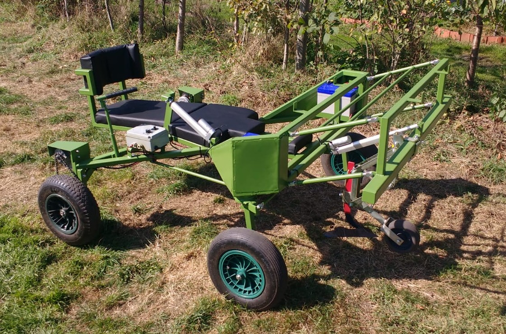

De sputnik is een tuinbouwmachine, speciaal en op maat gemaakt voor Bart, een persoon die een biologische deeltuin heeft, maar door een ski-ongeval in een rolstoel zit.

[Ronald Van Ham](https://github.com/RonaldVanHam) en [Elisa Van Coster](http://www.studiobasalt.be) werkten samen. Elisa ontwierp de machine en maakte het frame en besturing. Ronald deed de aansturing van de motoren.

In deze repo vind je:

- [Afbeeldingen](./images) met de afmetingen en details van de constructie
- [Broncode](./software) van de software
- [Ontwerpen](./designs) van de tandwielen en andere mechanicaonderdelen

## Frame

### Ontwerp

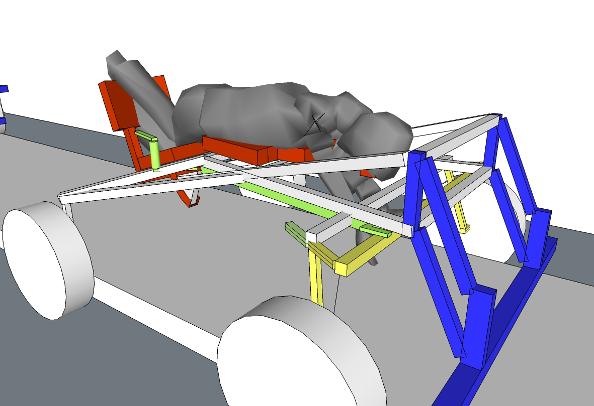

- De gele delen zijn de onderdelen van het stuur.
- De rode delen zijn die van de stoel die in zit- en lighouding gezet kan worden.
- De blauwe delen zijn die van de werktuigenbalk die in hoogte versteld kan worden.

### Afmetingen

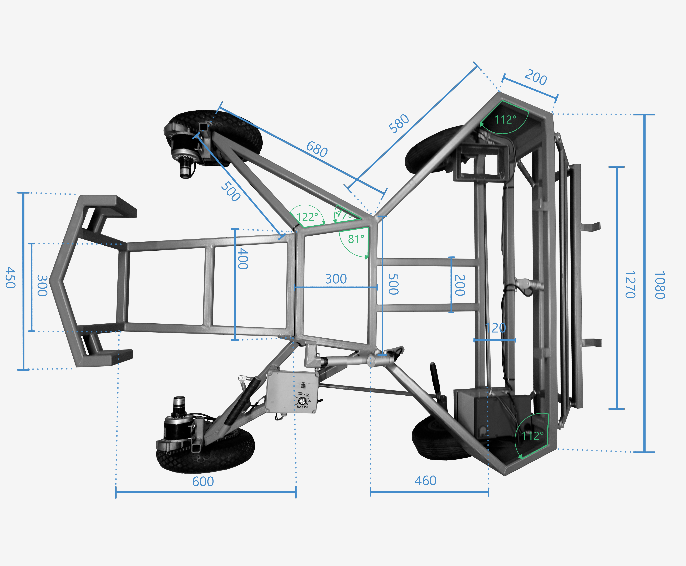

### Stuur

Het stuur zit op de voorstel wielen en is gebouwd volgens het [Ackermannprincipe](https://nl.wikipedia.org/wiki/Ackermann-principe)

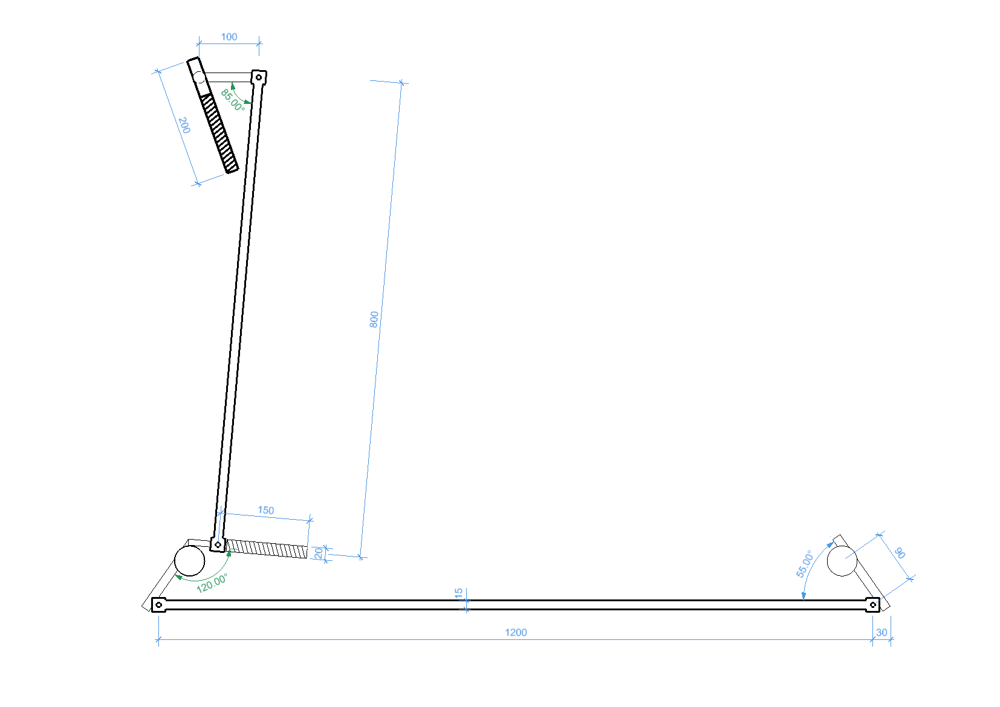

### Details

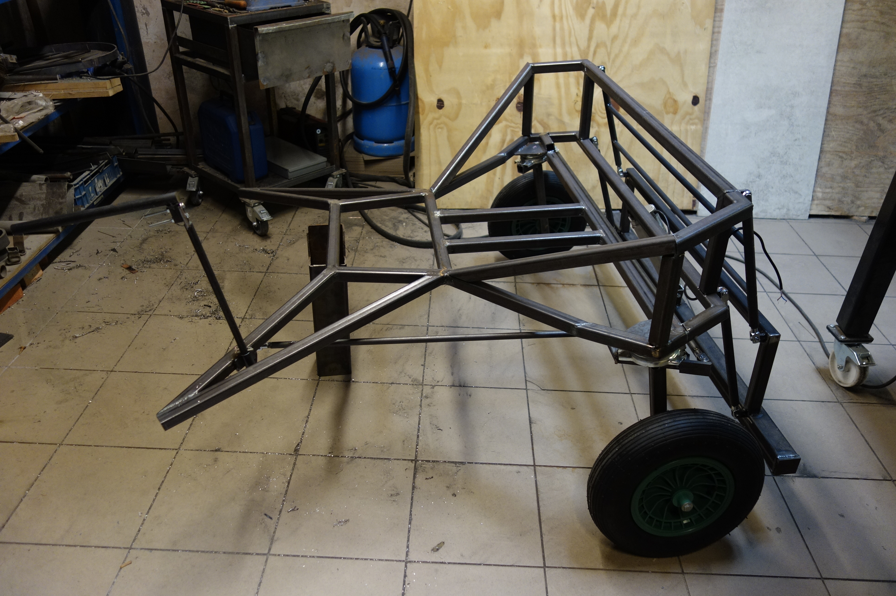
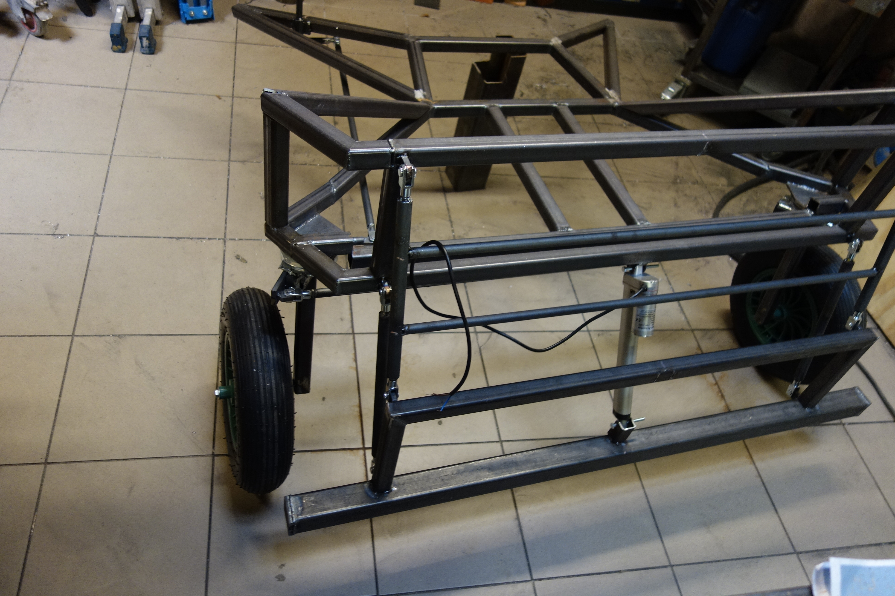
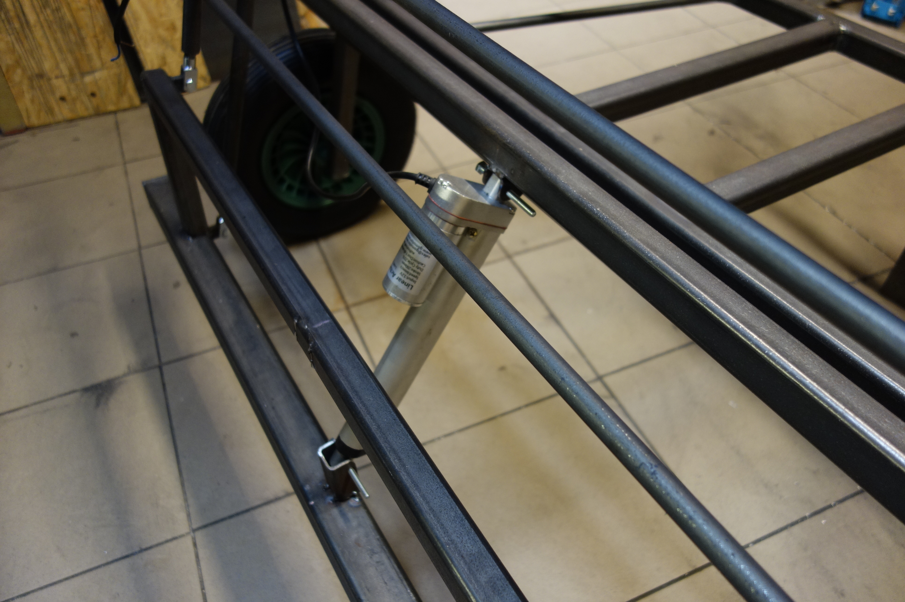
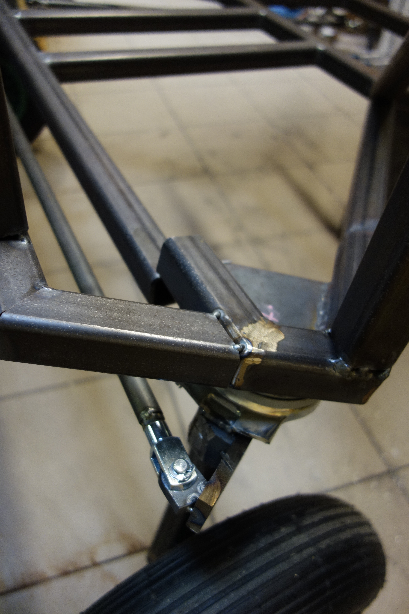
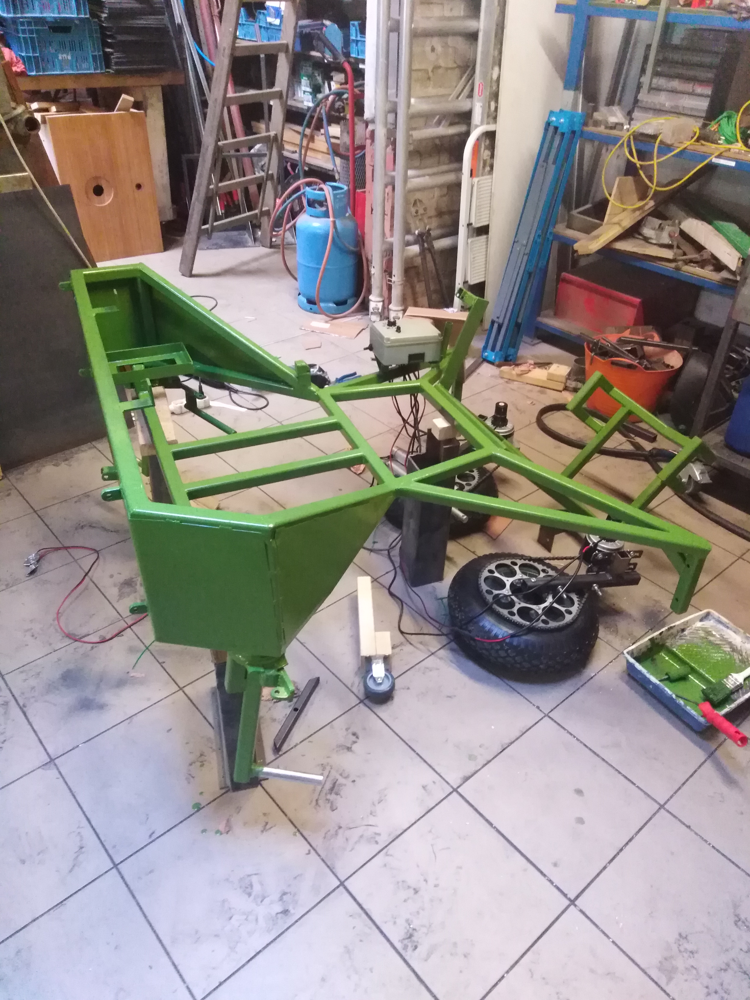 	

## Motoren

Om over de gewassen te kunnen rijden met aandrijving zijn er in principe 2 opties: 

Eén motor gebruiken en de twee wielen verbinden met een as *of* twee keer op elk wiel een motor zetten. 

Bart wil kunnen zitten en liggen. Het zaaibed is bovendien hoger dan de zijpaden waar de wielen op rusten. Een as zou dus de gewassen raken. Vandaar is het snel duidelijk dat een motor op elk wiel de enige optie is.

### Aandrijving

De motoren die gebruikt worden voor de aandrijving, zijn te verkrijgen via [ali express](https://www.aliexpress.com/w/my1016z-12v.html) of [forandor](https://forandor.com/index.php?route=product/product&path=68&product_id=324)

### Lineaire actuatoren

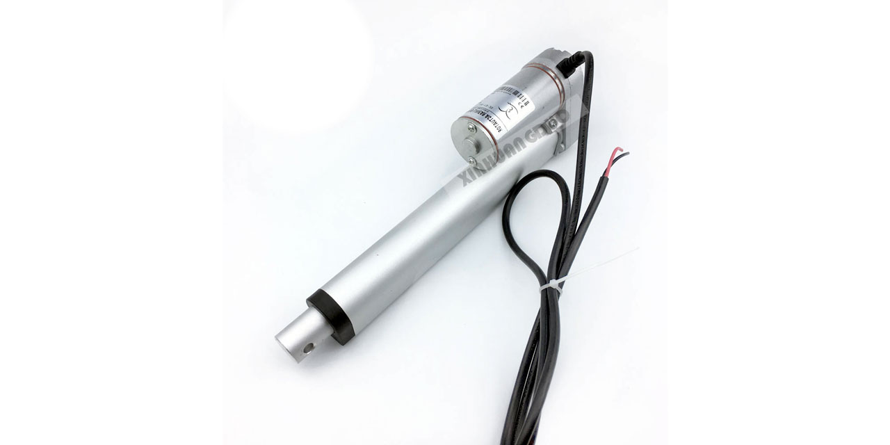

De motoren die gebruikt zijn voor de beweging van de stoel en de werktuigenbalk zijn lineaire actuatoren. Deze zijn [hier te krijgen](https://www.aliexpress.com/item/Free-shipping-24v-150mm-6inch-stroke-mini-linear-actuator-electric-linear-actuator-thrust-900N-customized-stroke/1647892597.html) en hebben een stang die op en neer kan bewegen in een nauwkeurige positie.

## Aandrijving

De extra uitdaging is dat Bart zowel snel, maar vooral heel traag wil kunnen rijden. Normaal wordt hiervoor een motor met een mechanische versnellingsbak gebruikt, zoals bijvoorbeeld ook in een auto zit.

Maar er zijn twee motoren en twee versnellingsbakken zou het geheel vrij zwaar en de bediening moeilijk maken. Ze moeten immers altijd in dezelfde versnelling staan.

Een DC motor gebruiken heeft het nadeel dat als je de DC heel traag wil later draaien, je de spanning zo laag moet maken dat ook de stroom en het koppel te klein wordt om nuttig te zijn. Dus de motor gaat waarschijnlijk gewoon niet draaien. 

### Closed loop

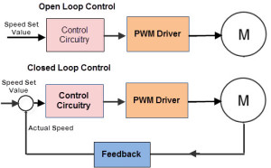

De DC motor wordt op een speciale manier aangestuurt, namelijk in 'closed loop'. Dat wil zeggen dat een snelheidsregelaar gebruikt wordt, geprogrammeerd in de [Arduino](./software/TuinbouwmachineBart/TuinbouwmachineBart.ino). 

We krijgen aan de ene kant een gevraagde snelheid via de potentiometer die Bart kan regelen. We gaan die in de controller vergelijken met de huidige snelheid die we meten via de optische encoder op de motor. We maken in de controller het verschil van deze twee snelheden. Dit noemen we de ‘fout’ (error) tussen wat we vragen en wat we meten. Deze fout gaan we gebruiken om de waarde van de PWM te bepalen. We gaan de fout met een bepaalde waarde vermenigvuldigen om de PWM waarde te krijgen, deze waarde noemen we de proportionele constante van onze regelaar. 

Dit gaat al redelijk werken, maar we merken op heel lage snelheden dat de motor toch gaat stilstaan, omdat de fout dan ook klein gaat zijn en de PWM waarde ook klein. Om dit op te lossen gaan we de fout 'integreren'. Dit wil zeggen dat we telkens de fout optellen en deze waarde vermenigvuldigen met een andere constante, de integrale constante van onze regelaar. Op deze manier gaat de PWM waarde verhogen als we langere tijd te traag draaien (of blijven stil staan). 

Nu komt het er op aan de 2 constanten van onze PI regelaar (proportioneel en integraal regelaar) juist in te stellen. Dit kan theoretisch aangepakt worden of we kunnen ze tunen ‘in the field’. Dit laatste is letterlijk te nemen, want Bart wil dat zijn machine traag door een veld kan rijden. Dit wil zeggen dat de weerstand kan veranderen naargelang er meer grond voor de wielen ligt of hij aan het rijden of schoffelen is. Dit theoretisch benaderen is moeilijk, want we hebben geen waarden van de weerstand die Bart gaat ondervinden op zijn veld. 

In dit geval hebben we bij deze waarden wel wat marge omdat gaat het om een tuinbouwmachine, waarbij de snelheid moet geregeld kunnen worden, maar ook niet super precies hoeft te zijn. Dus we gaan de waarden in ons atelier instellen en nadien aanpassen op het veld indien nodig.

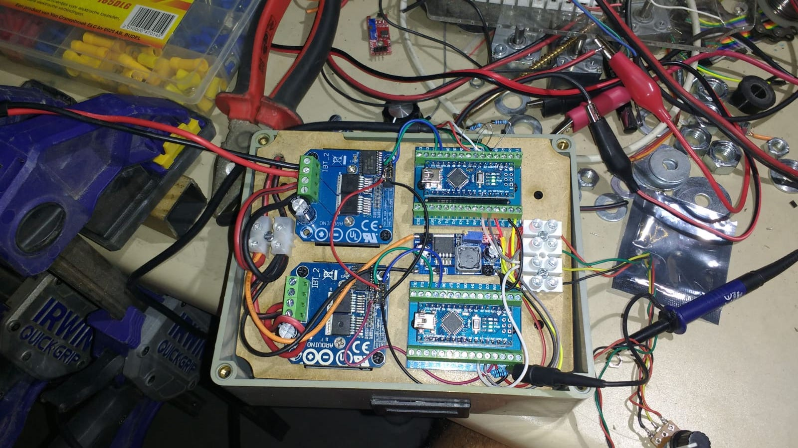

### De instelling van de gevraagde snelheid.

Omdat een potentiometer in de lage snelheden moeilijk in te stellen is, werken we met softwarematige versnellingen. We hebben een 2de knop geplaatst waarmee Bart kan kiezen tussen 1 versnelling achteruit, neutraal en 3 versnellingen vooruit. Dus de software gaat bij de achteruitstand van de knop, de richting van de motor omdraaien en de gevraagde snelheid beperken. Achteruit moet Bart immers niet zo snel kunnen rijden. Vooruit hebben we de snelheid in 3 stappen ingesteld. In 3de versnelling kunnen we de motor op volle snelheid aansturen, in 2de ongeveer zo snel als achteruit, en in 1ste heel traag. Dus de volledige toer van de potentiometer wordt herschaald naar een beperkt deel van de snelheid. Zo kan Bart ook op lage snelheden zijn gevraagde snelheid vrij precies instellen.

We hebben dus 2 snelheidsgestuurde motoren. Gevolg is dat de 2 wielen ook quasi even snel gaan draaien. Dit komt overeen met een starre achteras, dus zonder differentieel. Een differentieel bij een auto is een mechanisme met tandwielen dat toelaat dat de 2 wielen met een verschillende snelheid draaien. Dit is nodig als je een bocht neemt met een auto. Door onze 2 motoren in snelheid te sturen gaan de wielen in een  bocht even snel draaien en dus op de grond slippen. Om dit te vermijden gaan we in 3de versnelling en in achteruit de controle open loop doen, dus geen snelheidsterugkoppeling, en dus een soort softwarematige of elektrische differentieel. In 1ste en 2de gaat de closed loop werken, omdat we dan normaal geen grote bochten gaan maken en we daar die closed loop controle nodig hebben om de motoren traag te kunnen laten draaien. Hier rijden we dan alsof we een ‘sper-differentieel’ of starre achteras hebben.

### Andere types motoren

We hebben geopteerd voor een DC motor omdat dit voor de meeste makers gemakkelijker is in gebruik. Er bestaan ook brushless DC motoren (zonder koolborstels en met elektronische commutatie). Deze kunnen ook open loop en closed loop gebruikt worden. Om de positie en snelheid te meten, gebruiken deze meestal Hall sensoren. Deze dienen om de elektronische commutatie goed te kunnen aansturen maar zorgen ook meteen voor een feedback op de snelheid. Dit is te vergelijken met de encoder en closed loop DC motor die wij gebouwd hebben, alleen is de driver wat complexer in gebruik en ook complexer om uit te leggen tegenover de H-Brug bij de gewone DC motor.

## Afgewerkt

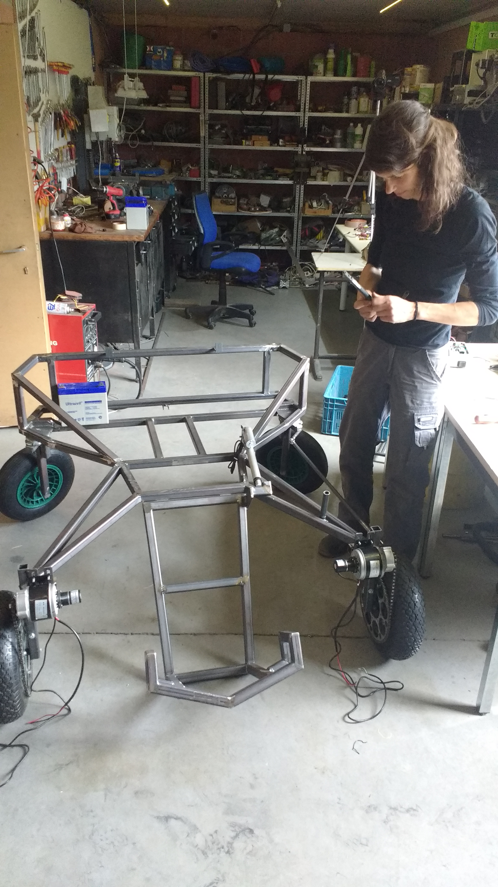
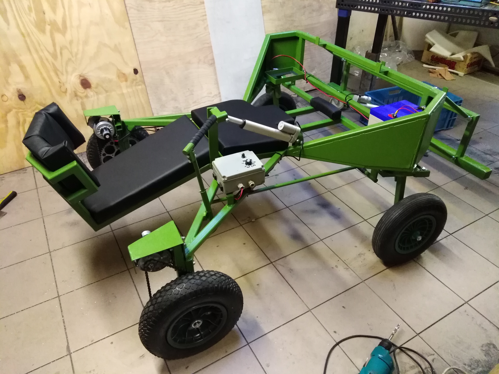